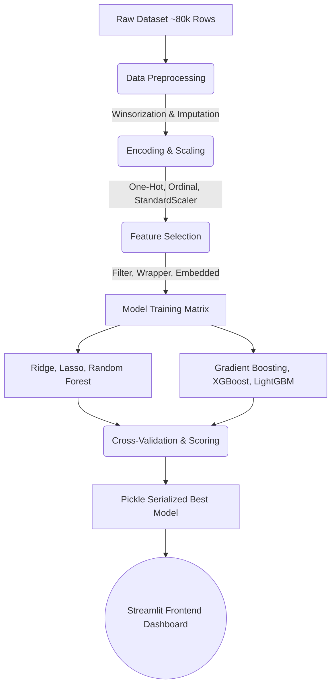

<div align="center">

  

  **An Enterprise-Grade Machine Learning Pipeline & Interactive Web Application for Forecasting Student Performance**

  <p align="center">
    <a href="https://www.python.org/"></a>
    <a href="https://streamlit.io/"></a>
    <a href="https://scikit-learn.org/"></a>
    <a href="https://xgboost.ai/"></a>
    <a href="https://plotly.com/"></a>
    
    
  </p>

  [Explore The Features](#-key-capabilities) •
  [Architecture](#-system-architecture) •
  [Installation](#-getting-started) •
  [Machine Learning Core](#-machine-learning-engine)
</div>

<br>

## 📌 Executive Summary

**EduPredict AI** is a state-of-the-art predictive analytics ecosystem designed to evaluate, model, and forecast student examination scores. By processing an extensively detailed dataset encompassing **~80,000 physiological, behavioral, and academic datapoints**, this project establishes a direct mathematical correlation between a student's daily habits and their ultimate academic success. 

The project culminates in an exquisitely designed, highly animated **Streamlit Web Dashboard**. This frontend empowers educational administrators or students to input real-time profile data and receive instantaneous AI inferences, powered by our custom serialized Ensemble Estimator.

---

## ⚡ Key Capabilities

| Icon | Feature | Description |
| :---: | :--- | :--- |
| 📊 | **Real-Time Inference** | Dynamic, real-time input manipulation yielding instant AI score predictions via our `best_student_model.pkl` inference engine. |
| 🎨 | **Hyper-Visual UI** | Incorporates advanced `Plotly` charting—including multidimensional Radar maps, feature bar charts, and dynamically responsive gauge meters. |
| 🧠 | **Robust ML Pipeline** | Deep exploratory data analysis, algorithmic data-cleaning (winsorization, median-imputation), and multi-model hypothesis testing. |
| 💡 | **Diagnostics Engine** | Goes beyond a raw score integer to generate deterministic, text-based recommendations (e.g., flagging *Screen Time* > 8 hrs violations). |

---

## 📸 Application Preview

<div align="center">
  <i>(Tip: Replace this placeholder with a GIF or Screenshot of your Streamlit app running in action!)</i>
  <br><br>
  
</div>

---

## 🏗 System Architecture

<details>
<summary><b>🖱️ Click to expand the full data flow architecture</b></summary>
<br>

We utilize a multi-phased Directed Acyclic Graph (DAG) approach for our pipeline:



</details>

---

## 🧠 Machine Learning Engine 

To ascertain the absolute best predictive capabilities, the ML engine runs an intensive grid-style evaluation logic across **18 separate permutations**:

<details>
<summary><b>🖱️ Click to view Evaluated Algorithms & Feature Selection Tactics</b></summary>
<br>

### 🔬 Feature Selection (Dimensionality Reduction)
1.  **Filter Methods**: Pearson Correlation + ANOVA F-test + Mutual Information Regression.
2.  **Wrapper Methods**: Recursive Feature Elimination (RFE) wrapping a Random Forest estimator.
3.  **Embedded Methods**: Lasso Coefficient Zeroing coupled with Mean Decrease in Impurity (MDI).

### 🤖 Algorithm Matrix
*   **Linear Baselines**: `Ridge Regression (L2)` and `Lasso Regression (L1)`
*   **Tree/Bagging**: `RandomForestRegressor`
*   **Sequential Boosting**: `GradientBoostingRegressor`, `XGBoostRegressor`, `LightGBMRegressor`

> **Note**: The pipeline evaluates across R², RMSE, MAE, and 5-Fold Cross-Val to determine the undisputed champion. That model is then hot-swapped into the Streamlit app.

</details>

---

## 🧬 Dataset Anatomy

The model thrives on the **Enhanced Student Habits** dataset.

<table>
  <tr>
    <td width="50%">
      <b>📚 Academic History</b><br>
      • Current Semester<br>
      • Previous GPA<br>
      • Major Selection<br>
      • Study Hours / Day<br>
      • Class Attendance (%)
    </td>
    <td width="50%">
      <b>🏃 Lifestyle & Health</b><br>
      • Sleep Hours<br>
      • Diet Quality (Ordinal)<br>
      • Exercise Frequency<br>
      • Mental Health (1-10)<br>
      • Total Screen Time
    </td>
  </tr>
  <tr>
    <td width="50%">
      <b>🧠 Psychological Markers</b><br>
      • Motivation Level (1-10)<br>
      • Exam Anxiety Score (1-10)<br>
      • Time Management Mastery<br>
      • Learning Style Preference
    </td>
    <td width="50%">
      <b>🏠 Socio-Economic Modifiers</b><br>
      • Parental Education & Support<br>
      • Internet Reliability<br>
      • Access to Tutoring<br>
      • Extracurricular Commitments
    </td>
  </tr>
</table>

---

## 🚀 Getting Started

Follow these instructions to mirror the environment and run the project locally.

### 1️⃣ Clone and Isolate Environment
It's highly advised to run this project inside an isolated virtual environment to prevent dependency conflicts.
```bash
# Clone the repository
git clone https://github.com/yourusername/EduPredict-AI.git
cd EduPredict-AI

# Create virtual environment
python -m venv venv

# Activate it (Windows)
venv\Scripts\activate
# Activate it (macOS/Linux)
source venv/bin/activate
```

### 2️⃣ Install Required Packages
```bash
pip install -r requirements.txt
```

### 3️⃣ Retrain the Ensembles (Optional)
If you wish to change the hyperparameters, observe the EDA distributions, or tweak the selection matrices, fire up Jupyter:
```bash
jupyter notebook
```
> Open `Student_Habits_Performance_Pipeline.ipynb` and select **"Run All"**. This handles the ingestion, compares all models, and seamlessly dumps the new `best_student_model.pkl`.

### 4️⃣ Deploy the Live Web Dashboard
Launch the bespoke, animated Streamlit UI:
```bash
streamlit run app.py
```
> Navigate to `http://localhost:8501` in your browser.

---

## 🛤️ Future Roadmap

- [ ] **Hyperparameter Tuning Script**: Integrate `Optuna` directly into the end of the Notebook for micro-optimizations.
- [ ] **SHAP Integration**: Provide SHapley Additive exPlanations on the Streamlit frontend to indicate *why* a student received a particular score.
- [ ] **FastAPI Backend Migration**: Decouple the monolithic Streamlit rendering from the model inference via a decoupled REST framework.

---

## 🤝 Contributing

We welcome pull requests! Whether it's adding a new gradient boosting library, polishing the UI animations, or augmenting the raw dataset. 

1. Fork the Project
2. Create a Feature Branch (`git checkout -b feature/NewMLModel`)
3. Commit Changes (`git commit -m 'Added CatBoost integration'`)
4. Push Iteration (`git push origin feature/NewMLModel`)
5. Open a Pull Request

<br>

<div align="center">
  
  <p><b>Built with absolute precision for Educational Data Science.</b></p>
  <p>&copy; 2026 EduPredict AI. MIT License.</p>
</div>
